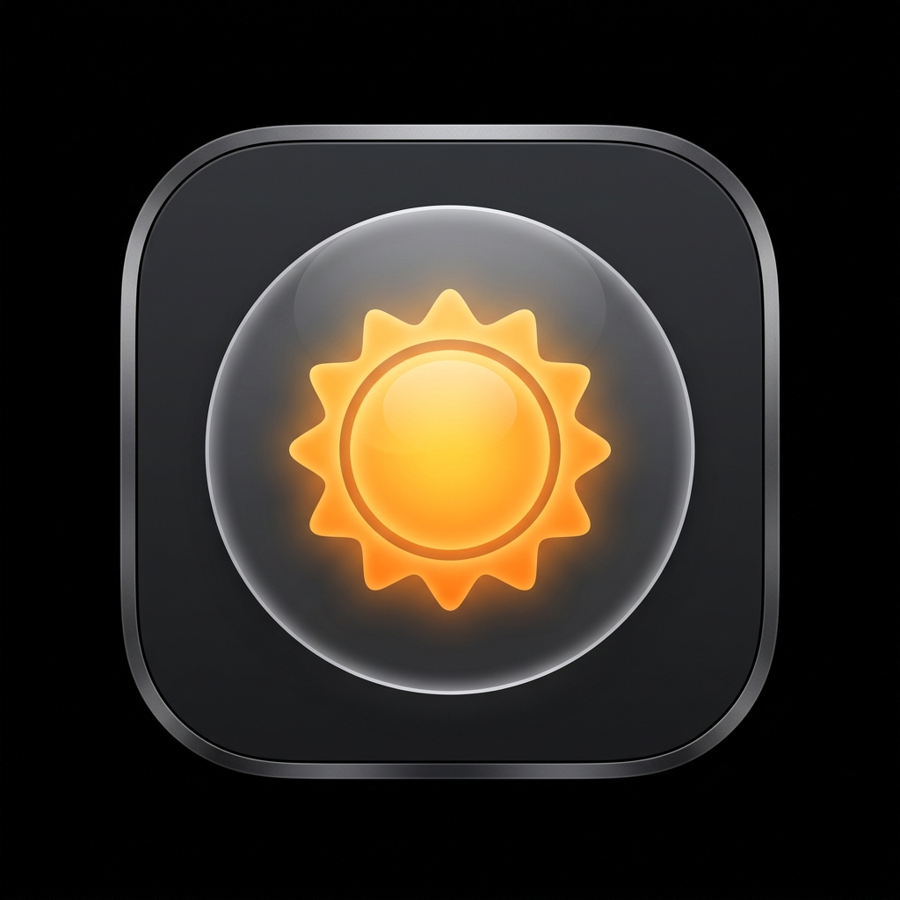

# Squint

<p align="center">
  
</p>

<p align="center">
  <b>Squint</b> is a lightweight macOS menu bar utility that lets you temporarily suppress auto-brightness for a chosen duration (e.g., during color-sensitive work, presentations, or watching videos) and automatically restores it when the timer expires.
</p>

<p align="center">
  <a href="https://github.com/dupontcyborg/squint/releases/latest">
    
  </a>
</p>

## Features

- **Duration Presets:** Suppress auto-brightness for 15 minutes, 30 minutes, 1 hour, 2 hours, or indefinitely.
- **Graceful Quit & Crash Recovery:** Automatically restores your original system auto-brightness setting when you close the app or if it crashes.
- **System Sync:** Checks auto-brightness state dynamically. If auto-brightness is already disabled system-wide, Squint displays a warning and disables the duration selection.
- **Sleep/Wake Aware:** Automatically pauses the suppression timer when your Mac goes to sleep and resumes it upon wake.
- **Launch at Login:** Option to automatically launch Squint when you log in, utilizing the modern `SMAppService` API (macOS 13+).

## Requirements

- macOS 13 (Ventura) or newer.
- A built-in display or compatible external Apple display (Studio Display / Pro Display XDR) that supports ambient light compensation.

## Getting Started

### Build locally

Squint is built using Swift Package Manager. You can compile the project and bundle it into a `.app` package using the provided build script:
```bash
./build.sh
```

### Run the App

Launch the compiled application bundle:
```bash
open build/Squint.app
```

## Packaging a Release

To create a drag-and-drop DMG for distribution:
```bash
./create_dmg.sh
```
This generates a `Squint-[VERSION].dmg` file in the repository root.

## License
MIT License. See [LICENSE](LICENSE) (or the repository info) for details.
